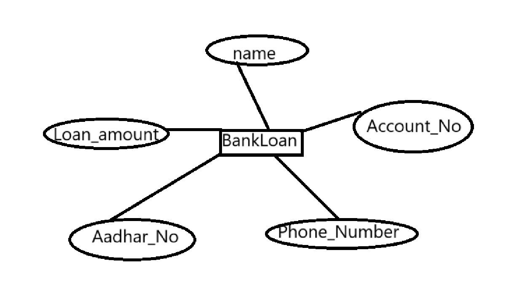
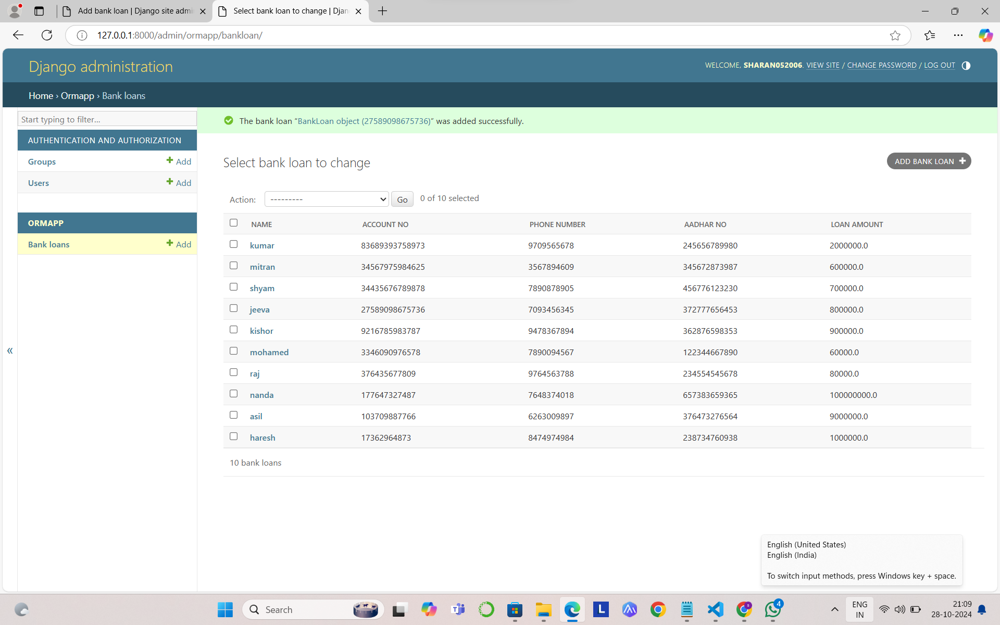

# Ex02 Django ORM Web Application
## Date: 28-10-24

## AIM
To develop a Django application to store and retrieve data from a bank loan database using Object Relational Mapping(ORM).

## ENTITY RELATIONSHIP DIAGRAM





## DESIGN STEPS

### STEP 1:
Clone the problem from GitHub

### STEP 2:
Create a new app in Django project

### STEP 3:
Enter the code for admin.py and models.py

### STEP 4:
Execute Django admin and create details for 10 books

## PROGRAM
```
admin.py

from django.contrib import admin
from .models import BankLoan,BankAdmin 
admin.site.register(BankLoan,BankAdmin)

models.py

from django.db import models
from django.contrib import admin
class BankLoan(models.Model):
    Name = models.CharField(max_length=100)
    Account_No = models.IntegerField(primary_key="Account_No")
    Phone_Number = models.IntegerField()
    Aadhar_No = models.IntegerField()
    Loan_amount = models.FloatField()
     
class BankAdmin(admin.ModelAdmin):
    list_display = ('Name', 'Account_No', 'Phone_Number','Aadhar_No', 'Loan_amount')
```


## OUTPUT

Include the screenshot of your admin page.




## RESULT
Thus the program for creating a database using ORM hass been executed successfully
